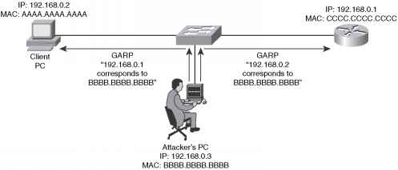
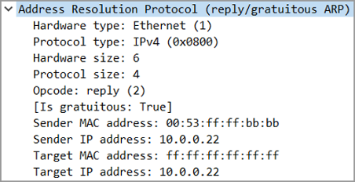

# Malformed ARP Block

**Auto-detect and block malformed ARP requests coming from random sources and excessive ARP/GARP requests**

The Python script allows a Nexus 7000 system to automatically detect if malformed ARP packets (length greater than 128 bytes) are hitting the control plane.
Upon detection via deep packet inspection, the script creates a separate ARP access-list with the offending mac addresses. The "quarantine" access-list can be policed separately, allowing control plane protection.



**ARP**
ARP is an L2 protocol, used for discovering the MAC address (i.e physical address) of an IP address. This discovery is performed via an L2 broadcast, for example:

    Sender/ARP Request: Hey Guys, does anyone know the MAC address for 192.168.1.100?
    Receiver/ARP Reply: Yep that's me! My MAC address is 00:11:22:33:44:55.

Once the MAC address is learned it is placed within an ARP table (cache) for future use

**Gratuitous ARP (GARP)**
A Gratuitous ARP is an ARP Response that was not prompted by an ARP Request. The Gratuitous ARP is sent as a broadcast, as a way for a node to announce or update its IP to MAC mapping to the entire network.

A typical use case for GARP is around network HA and where a VIP is used. At the point the active node fails and the backup node assumes the active role, it will send a GARP to the network informing all nodes of the VIPs mac address, i.e itself. Below shows an example of the packet.



Example:
ARP access list copp-arp-quarantine

```
30 permit ip any mac host 0000.0700.0702
10 permit ip any mac host 0000.0700.0700
20 permit ip any mac host 0000.0700.0701
```

The script also checks for excessive ARP/GARP. Upon detection via deep packet inspection, the script creates a separate ARP access-list (throttle) with the offending mac addresses

When the script run for the first time, it checks if there is a standard CoPP configured based on well know system profiles "dense", "lenient", "moderate", "strict".
In case a standard CoPP is configured, a Custom profile will be configured based on the system profile originally configured

After this initial check, the script starts a packet capture, 1000 ARP packets (this can be tuned).
Once the ARP packet capture is completed, the code look for malformed ARP.
The script then put the offending MACs into the Quarantine ARP access list.

Example:
```
Malformed ARP detected for MAC 00:00:07:00:07:00
Malformed ARP detected for MAC 00:00:07:00:07:01
Malformed ARP detected for MAC 00:00:07:00:07:02
```

**APPLY Quarantine settings!**

If no malformed ARP are detected the following message is printed:

**NO Malformed ARP detected!**

In case of excessive ARP/GARP requests the throttle logic will be applied

All the actions are logged into the syslog. Example:

```
ARP Python Script: Malformed ARP detected for MAC 00:00:07:00:07:00
ARP Python Script: Throttle MAC address 00:00:07:00:07:00, Seen 304 times (27%) during capture
ARP Python Script: Throttle GARP for IP address 10.10.10.2, Seen 202 times (17%) during capture
```